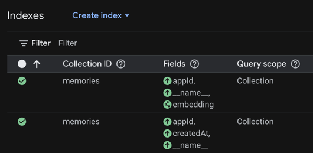

# Recall

Recall is a personal, cloud-hosted memory service for AI agents working on coding and non-coding projects.

## Project scope

Recall is a hobby project designed for personal, single-user use. It requires you to provision and manage your own cloud
infrastructure and associated costs.

Recall is inspired by my experience using Mem0. Mem0 is a great product, and the fact that I want to build a focused
project with a similar goal is a testament to how valuable I find it.

If you prefer a managed memory service with minimal setup and customer support, consider using Mem0 instead.

## Why I am building this

I began with Mem0 to give AI agents persistent context, but the free tier was too limited for regular use. The Mem0
dashboard showed a hobby plan with limited retrieval capacity, while the paid plan was roughly **₹2,000 per month** in
my local estimate.

That made me wonder:

> If I build my own focused version on Google Cloud, can the monthly cost be dramatically lower than ₹2,000 while still
> giving me the memory workflow I actually need?

I have a good feeling that the answer is yes. Recall is the experiment: build only the core memory capabilities, use
serverless infrastructure, and measure the real cost instead of paying for a broad hosted product before I need it.

## What Recall provides

- Persistent memories scoped by project (`appId`).
- Semantic search over saved memories using vector embeddings.
- MCP-compatible memory tools at `/v1/mcp` and a health endpoint at `/v1/health`.
- Google Cloud Firestore persistence and Cloud Run deployment.

Memory operations use MCP tools rather than a custom REST API. MCP initialization
provides the guidance for selecting and consolidating durable memories.

See [docs/ARCHITECTURE.md](docs/ARCHITECTURE.md) for architecture details and
[PLAN.md](PLAN.md) for the implementation roadmap.

## Self-host on Google Cloud

This guide provisions a personal, single-user Recall deployment through the
Google Cloud Console. It uses the generated Cloud Run URL; custom domains and
load balancers are not required.

### My setup

| Service             | Setting                                                                |
|---------------------|------------------------------------------------------------------------|
| Firestore           | Standard edition, Native mode, `asia-southeast1`                       |
| Cloud Run           | `asia-southeast1`                                                      |
| Public health check | [recall.abhiroop.dev/v1/health](https://recall.abhiroop.dev/v1/health) |

These are my deployment choices, not requirements for self-hosting. I kept both
services in `asia-southeast1` because it supports Cloud Run domain mapping and is
the closest supported region to me in India. I use `recall.abhiroop.dev` for Recall.
`/v1/health` is intentionally public; the MCP endpoint at `/v1/mcp` requires
`Authorization: Bearer <RECALL_API_KEY>`. Custom domains are outside this minimal
guide.

### 1. Fork and configure the project

1. Fork [Abhiroop25902/recall](https://github.com/Abhiroop25902/recall) and clone your fork.
2. Create a Google Cloud project with billing enabled.
3. Enable the Cloud Run, Cloud Build, Artifact Registry, Firestore, Secret Manager,
   and Vertex AI APIs.
4. In the Firestore Console, create a Firestore database in **Native mode** in your
   chosen region.
5. Replace `recall.gcp-project-id` in `application.properties` with the new project
   ID, commit the change, and push it to your fork.

### 2. Create the API key and runtime identity

Generate a 256-bit API key locally, or use a password manager's generator:

```bash
openssl rand -hex 32
```

In the Secret Manager Console, create a secret named `RECALL_API_KEY` and paste the
generated value.

Keep the same value available to OpenCode on your machine. Add it to `~/.zshrc`:

```bash
export RECALL_API_KEY="generated-key"
```

This local environment variable authenticates OpenCode. Cloud Run does not use it
as an environment variable: the application resolves `sm@RECALL_API_KEY` directly
from Secret Manager.

Create a dedicated Cloud Run runtime service account. Grant it:

- **Secret Manager Secret Accessor** on `RECALL_API_KEY`.
- **Cloud Datastore User** for Firestore access.
- **Agent Platform User** for Vertex AI embedding inference.

Also grant the Cloud Build deployer service account **Service Account User** on the
runtime service account. This allows deployments to attach the runtime identity.

### 3. Create the continuous deployment

In the Cloud Run Console, use the continuous-deployment wizard to connect your
forked GitHub repository. Select the branch to deploy, the runtime service account,
and public access. Add an HTTP startup probe for `/v1/health` and leave Cloud Run's
default timing settings unchanged. No additional port configuration is required:
Cloud Run's default container port is compatible with Spring Boot's default port
`8080`.

The wizard creates the Cloud Build trigger, Cloud Run service, and Artifact Registry
repository using the Java buildpack; no Dockerfile is needed. It also starts the
first deployment automatically.

Once the Artifact Registry repository exists, add a cleanup policy to retain only a
bounded number of recent images or delete images after a chosen age. Artifact
Registry does not enforce an automatic image-version limit, so stored images otherwise
increase cost over time.

Wait for the deployment to become ready, then copy its generated URL. As an optional
quick public check, open:

```text
https://SERVICE_URL/v1/health
```

It returns:

```json
{
  "status": "UP",
  "service": "recall"
}
```

## Connect OpenCode

Merge this MCP server into `~/.config/opencode/opencode.json`, replacing
`SERVICE_URL` with the generated Cloud Run URL:

```json
{
  "mcp": {
    "recall": {
      "type": "remote",
      "url": "https://SERVICE_URL/v1/mcp",
      "enabled": true,
      "headers": {
        "Authorization": "Bearer {env:RECALL_API_KEY}"
      }
    }
  }
}
```

Open a new terminal or reload your shell after changing `~/.zshrc`, then restart
OpenCode. Initialize the Recall MCP server and confirm that its tools are discovered.

Do not commit the API key, include it in a URL, or add it to application configuration.

## Create Firestore indexes

Use OpenCode to call `saveMemory` with a unique temporary `appId`. Firestore has no
table or schema to create manually: this first save creates the `memories` collection
with the document shape used by Recall.

In the Firestore Console, create these indexes for the `memories` collection:


- A vector index with `appId` ascending and a 1536-dimensional flat vector index on
  `embedding`.
- A composite index with `appId` ascending, `createdAt` ascending, and document ID
  ascending.

Wait for both indexes to become ready before testing retrieval.

## Verify the deployment

1. Request `https://SERVICE_URL/v1/mcp` without a bearer token and confirm it returns
   `401`.
2. From OpenCode, retrieve the temporary memory, delete it, and confirm it is gone.

## Local checks

Run the unit tests locally:

```bash
./gradlew test
```

`./gradlew bootRun` is not a standalone local mode. It requires Application Default
Credentials and access to Firestore, Vertex AI, and Secret Manager in a real Google
Cloud project.

## Current cost observation

As of September 6, 2026, during active development, Cloud Run and Vertex AI usage
costs about ₹0.03 per day. This is not a production estimate: costs vary with traffic,
embedding volume, retained data, and Google Cloud pricing. Artifact Registry storage
is excluded because its cost is driven by development image churn and the configured
cleanup policy.

## Current latency observation

At `2026-09-06T06:59:52Z`, the deployed benchmark made an unmeasured health request,
then five warm-up saves.

| Operation                | Samples |    p50 |    p95 |
|--------------------------|--------:|-------:|-------:|
| Save                     |      30 | 545 ms | 658 ms |
| Scoped top-one retrieval |      30 | 552 ms | 755 ms |

These are end-to-end client measurements that include network, Cloud Run, Vertex AI
embeddings, and Firestore. The benchmark deleted and verified cleanup of all 36
temporary records it created.

## Development note

I built Recall manually, using OpenCode for research, planning, and code review.
I used AI-assisted workflows to write and iterate on the test and
latency-benchmark tooling. The reported tests and benchmarks were executed
against the application; they are not simulated results.
